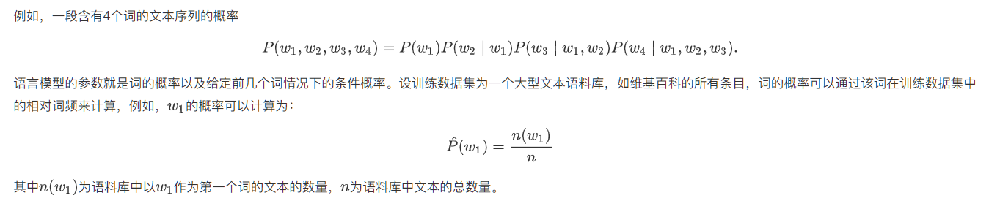
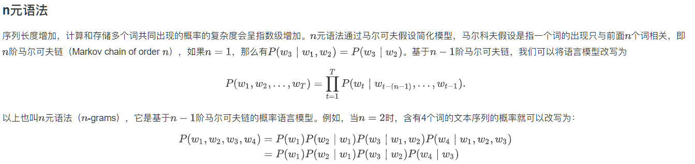
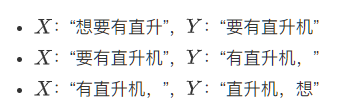
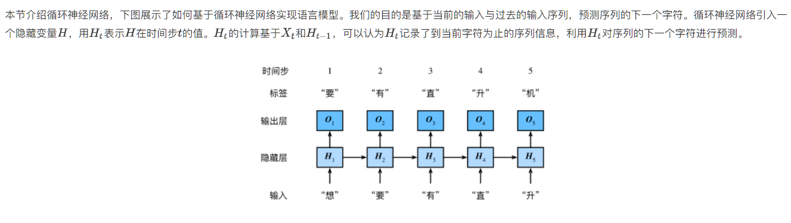
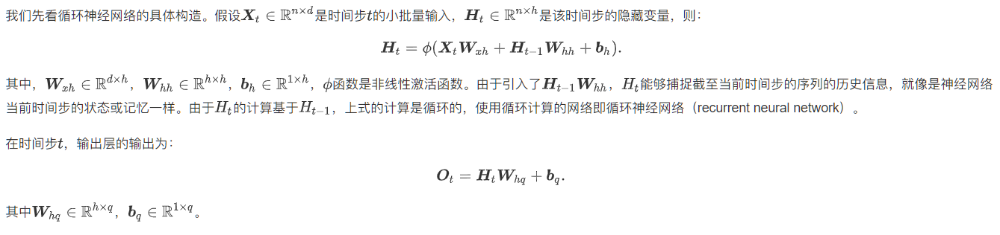
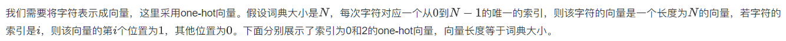
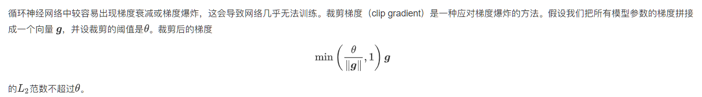

## Task02（文本预处理、语言模型、循环神经网络基础）

### 文本预处理

文本是一类序列数据，一篇文章可以看作是字符或单词的序列，本节将介绍文本数据的常见预处理步骤，预处理通常包括四个步骤：

1. 读入文本
2. 分词
3. 建立字典，将每个词映射到一个唯一的索引（index）
4. 将文本从词的序列转换为索引的序列，方便输入模型

**已有工具简洁操作**

```
text = "Mr. Chen doesn't agree with my suggestion."

#spacy工具进行分词
import spacy
nlp = spacy.load('en_core_web_sm')
doc = nlp(text)
print([token.text for token in doc])

#NLTK进行分词
from nltk.tokenize import word_tokenize
from nltk import data
data.path.append('/home/kesci/input/nltk_data3784/nltk_data')
print(word_tokenize(text))

['Mr.', 'Chen', 'does', "n't", 'agree', 'with', 'my', 'suggestion', '.']
```

该工具克服了以下缺点：

1. 标点符号通常可以提供语义信息，但是我们的方法直接将其丢弃了
2. 类似“shouldn't", "doesn't"这样的词会被错误地处理
3. 类似"Mr.", "Dr."这样的词会被错误地处理


### 语言模型

#### （1）n元语言模型





缺点：

1、参数空间过大

2、数据稀疏

#### （2）时序数据采样

在训练中我们需要每次随机读取小批量样本和标签。与之前章节的实验数据不同的是，时序数据的一个样本通常包含连续的字符。假设时间步数为5，样本序列为5个字符，即“想”“要”“有”“直”“升”。该样本的标签序列为这些字符分别在训练集中的下一个字符，即“要”“有”“直”“升”“机”，即X=“想要有直升”，Y=“要有直升机”。



如果序列的长度为T，时间步数为n，那么一共有T−n个合法的样本，但是这些样本有大量的重合，我们通常采用更加高效的采样方式。

##### 2.1 随机采样

在随机采样中，每个样本是原始序列上任意截取的一段序列，相邻的两个随机小批量在原始序列上的位置不一定相毗邻。

```
import torch
import random
def data_iter_random(corpus_indices, batch_size, num_steps, device=None):
    # 减1是因为对于长度为n的序列，X最多只有包含其中的前n - 1个字符
    num_examples = (len(corpus_indices) - 1) // num_steps  # 下取整，得到不重叠情况下的样本个数
    example_indices = [i * num_steps for i in range(num_examples)]  # 每个样本的第一个字符在corpus_indices中的下标
    random.shuffle(example_indices)

    def _data(i):
        # 返回从i开始的长为num_steps的序列
        return corpus_indices[i: i + num_steps]
    if device is None:
        device = torch.device('cuda' if torch.cuda.is_available() else 'cpu')
    
    for i in range(0, num_examples, batch_size):
        # 每次选出batch_size个随机样本
        batch_indices = example_indices[i: i + batch_size]  # 当前batch的各个样本的首字符的下标
        X = [_data(j) for j in batch_indices]
        Y = [_data(j + 1) for j in batch_indices]
        yield torch.tensor(X, device=device), torch.tensor(Y, device=device)
```

##### 2.2 相邻采样

在相邻采样中，相邻的两个随机小批量在原始序列上的位置相毗邻。

```
def data_iter_consecutive(corpus_indices, batch_size, num_steps, device=None):
    if device is None:
        device = torch.device('cuda' if torch.cuda.is_available() else 'cpu')
    corpus_len = len(corpus_indices) // batch_size * batch_size  # 保留下来的序列的长度
    corpus_indices = corpus_indices[: corpus_len]  # 仅保留前corpus_len个字符
    indices = torch.tensor(corpus_indices, device=device)
    indices = indices.view(batch_size, -1)  # resize成(batch_size, )
    batch_num = (indices.shape[1] - 1) // num_steps
    for i in range(batch_num):
        i = i * num_steps
        X = indices[:, i: i + num_steps]
        Y = indices[:, i + 1: i + num_steps + 1]
        yield X, Y
```

### 循环神经网络基础





#### One-hot 向量



```
def one_hot(x, n_class, dtype=torch.float32):
    result = torch.zeros(x.shape[0], n_class, dtype=dtype, device=x.device)  # shape: (n, n_class)
    result.scatter_(1, x.long().view(-1, 1), 1)  # result[i, x[i, 0]] = 1
    return result
    
x = torch.tensor([0, 2])
x_one_hot = one_hot(x, vocab_size)
print(x_one_hot)
print(x_one_hot.shape)
print(x_one_hot.sum(axis=1))
```

#### 剪裁梯度



```
def grad_clipping(params, theta, device):
    norm = torch.tensor([0.0], device=device)
    for param in params:
        norm += (param.grad.data ** 2).sum()
    norm = norm.sqrt().item()
    if norm > theta:
        for param in params:
            param.grad.data *= (theta / norm)
```

#### 困惑度

我们通常使用困惑度（perplexity）来评价语言模型的好坏。回忆一下“softmax回归”一节中交叉熵损失函数的定义。困惑度是对交叉熵损失函数做指数运算后得到的值。特别地，

- 最佳情况下，模型总是把标签类别的概率预测为1，此时困惑度为1；
- 最坏情况下，模型总是把标签类别的概率预测为0，此时困惑度为正无穷；
- 基线情况下，模型总是预测所有类别的概率都相同，此时困惑度为类别个数。

显然，任何一个有效模型的困惑度必须小于类别个数。在本例中，困惑度必须小于词典大小vocab_size。

#### RNN网络常用函数参数简介

```
我们使用Pytorch中的nn.RNN来构造循环神经网络。在本节中，我们主要关注nn.RNN的以下几个构造函数参数：

input_size - The number of expected features in the input x
hidden_size – The number of features in the hidden state h
nonlinearity – The non-linearity to use. Can be either 'tanh' or 'relu'. Default: 'tanh'
batch_first – If True, then the input and output tensors are provided as (batch_size, num_steps, input_size). Default: False
这里的batch_first决定了输入的形状，我们使用默认的参数False，对应的输入形状是 (num_steps, batch_size, input_size)。

forward函数的参数为：

input of shape (num_steps, batch_size, input_size): tensor containing the features of the input sequence.
h_0 of shape (num_layers * num_directions, batch_size, hidden_size): tensor containing the initial hidden state for each element in the batch. Defaults to zero if not provided. If the RNN is bidirectional, num_directions should be 2, else it should be 1.
forward函数的返回值是：

output of shape (num_steps, batch_size, num_directions * hidden_size): tensor containing the output features (h_t) from the last layer of the RNN, for each t.
h_n of shape (num_layers * num_directions, batch_size, hidden_size): tensor containing the hidden state for t = num_steps.
```

