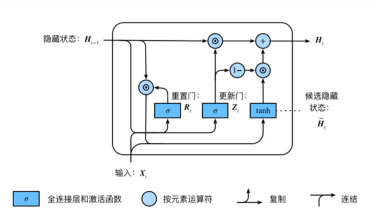
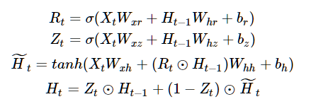
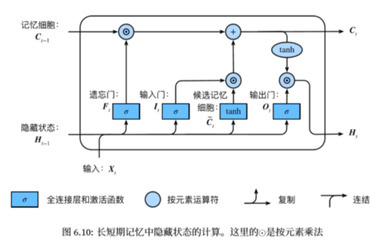
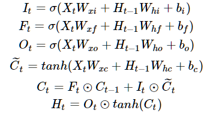
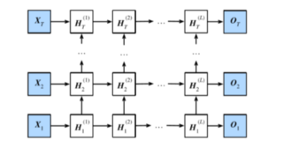
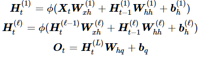
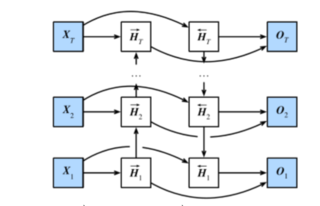
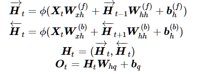

### Task03-(过拟合、欠拟合，梯度消失、爆炸，循环神经网络进阶)

#### **过拟合欠拟合及其解决方案**

**训练误差**：指模型在训练数据集上表现出的误差。

**泛化误差**：指模型在任意一个测试数据样本上表现出的误差的期望，并常常通过测试数据集上的误差来近似（尽量降低泛化误差）。

**模型数据划分**

1：添加验证集

测试集只能在所有超参数和模型参数选定后使用一次。不可以使用测试数据选择模型，如调参。由于无法从训练误差估计泛化误差，因此也不应只依赖训练数据选择模型。鉴于此，我们可以预留一部分在训练数据集和测试数据集以外的数据来进行模型选择。这部分数据被称为验证数据集，简称验证集（validation set）。

2：K折交叉验证（数据样本较小的情况）

当训练数据不够用时，预留大量的验证数据显得太奢侈。一种改善的方法是K折交叉验证（K-fold cross-validation）。在K折交叉验证中，我们把原始训练数据集分割成K个不重合的子数据集，然后我们做K次模型训练和验证。每一次，我们使用一个子数据集验证模型，并使用其他K-1个子数据集来训练模型。在这K次训练和验证中，每次用来验证模型的子数据集都不同。最后，我们对这K次训练误差和验证误差分别求平均。

##### 过拟合和欠拟合

1：过拟合

模型的训练误差远小于它在测试数据集上的误差，我们称该现象为过拟合（overfitting）。 在实践中，我们要尽可能同时应对欠拟合和过拟合。

2：欠拟合

模型无法得到较低的训练误差，我们将这一现象称作欠拟合（underfitting）

影响因素：

1、模型复杂度   


2、训练数据集规模

一般来说，如果训练数据集中样本数过少，特别是比模型参数数量（按元素计）更少时，过拟合更容易发生。此外，泛化误差不会随训练数据集里样本数量增加而增大。因此，在计算资源允许的范围之内，我们通常希望训练数据集大一些，特别是在模型复杂度较高时，例如层数较多的深度学习模型。

**解决方案权重衰减**

1、L2范数正则化

L2范数正则化在模型原损失函数基础上添加L2范数惩罚项，从而得到训练所需要最小化的函数。L2范数惩罚项指的是模型权重参数每个元素的平方和与一个正的常数的乘积。


其中w1,w2是权重参数，b是偏差参数，样本i的输入为x1(i),x2(i)，标签为y(i)，样本数为n。将权重参数用向量w=[w1,w2]表示。

```
optimizer_w = torch.optim.SGD(params=[net.weight], lr=lr, weight_decay=wd) # 对权重参数衰减
optimizer_b = torch.optim.SGD(params=[net.bias], lr=lr)  # 不对偏差参数衰减

```

2、丢弃法


```
net = nn.Sequential(
        d2l.FlattenLayer(),
        nn.Linear(num_inputs, num_hiddens1),
        nn.ReLU(),
        nn.Dropout(drop_prob1),
        nn.Linear(num_hiddens1, num_hiddens2), 
        nn.ReLU(),
        nn.Dropout(drop_prob2),
        nn.Linear(num_hiddens2, 10)
        )

```

### 梯度消失、爆炸

**当神经网络的层数较多时，模型的数值稳定性容易变差**

假设一个层数为L的多层感知机的第l层H(l)的权重参数为*W(l)*，输出层H(L)的权重参数为*W(L)*。为了便于讨论，不考虑偏差参数，且设所有隐藏层的激活函数为恒等映射（identity mapping）*ϕ(x)=x*。给定输入*X*，多层感知机的第l层的输出*`<u>H(l)=XW(1)W(2)…W(l)。</u>``*

l **梯度消失**

此时，如果层数l较大，H(l)的计算可能会出现衰减，假设输入和所有层的权重参数都是标量，如权重参数为**0.2**，多层感知机的第30层输出为输入X分别与0.230≈1×10−21（消失）的乘积。

l **梯度爆炸**

如权重参数为**5****，**多层感知机的第30层输出为输入X分别与530≈9×1020（爆炸）的乘积。

l **措施：参数随机初始化**

原理：


1、PyTorch的默认随机初始化**

随机初始化模型参数的方法有很多。在线性回归的简洁实现中，我们使用torch.nn.init.normal_()使模型net的权重参数采用正态分布的随机初始化方式。不过，PyTorch中nn.Module的模块参数都采取了较为合理的初始化策略，因此一般不用我们考虑。

2、Xavier随机初始化**

还有一种比较常用的随机初始化方法叫作Xavier随机初始化。 假设某全连接层的输入个数为，输出个数为，Xavier随机初始化将使该层中权重参数的每个元素都随机采样于均匀分布

它的设计主要考虑到，模型参数初始化后，每层输出的方差不该受该层输入个数影响，且每层梯度的方差也不该受该层输出个数影响。

**环境因素：**

1、 协变量偏移 2、标签偏移 3、概念偏移

### 循环神经网络进阶

RNN网络存在的问题：

1、梯度较容易出现衰减或爆炸（BPTT）。

2、无法捕捉时间序列中时间步较大带来的序列片段的依赖关系。

#### GRU: ⻔控循环神经⽹络：捕捉时间序列中时间步距离较大的依赖关系





• 重置⻔有助于捕捉时间序列⾥短期的依赖关系；
• 更新⻔有助于捕捉时间序列⾥⻓期的依赖关系。

PyTorch简洁实现

```
num_hiddens=256
num_epochs, num_steps, batch_size, lr, clipping_theta = 160, 35, 32, 1e2, 1e-2
pred_period, pred_len, prefixes = 40, 50, ['分开', '不分开']

lr = 1e-2 # 注意调整学习率
gru_layer = nn.GRU(input_size=vocab_size, hidden_size=num_hiddens)
model = d2l.RNNModel(gru_layer, vocab_size).to(device)
d2l.train_and_predict_rnn_pytorch(model, num_hiddens, vocab_size, device,
                                corpus_indices, idx_to_char, char_to_idx,
                                num_epochs, num_steps, lr, clipping_theta,
                                batch_size, pred_period, pred_len, prefixes)
```

#### LSTM **长短期记忆long short-term memory** 





遗忘门:控制上一时间步的记忆细胞 输入门:控制当前时间步的输入
输出门:控制从记忆细胞到隐藏状态
记忆细胞：⼀种特殊的隐藏状态的信息的流动

PyTorch简洁实现

```
num_hiddens=256
num_epochs, num_steps, batch_size, lr, clipping_theta = 160, 35, 32, 1e2, 1e-2
pred_period, pred_len, prefixes = 40, 50, ['分开', '不分开']

lr = 1e-2 # 注意调整学习率
lstm_layer = nn.LSTM(input_size=vocab_size, hidden_size=num_hiddens)
model = d2l.RNNModel(lstm_layer, vocab_size)
d2l.train_and_predict_rnn_pytorch(model, num_hiddens, vocab_size, device,
                                corpus_indices, idx_to_char, char_to_idx,
                                num_epochs, num_steps, lr, clipping_theta,
                                batch_size, pred_period, pred_len, prefixes)
```

#### 深度循环神经网络





PyTorch简洁实现（相比LSTM多了**num_layers**参数）

```
num_hiddens=256
num_epochs, num_steps, batch_size, lr, clipping_theta = 160, 35, 32, 1e2, 1e-2
pred_period, pred_len, prefixes = 40, 50, ['分开', '不分开']

lr = 1e-2 # 注意调整学习率

gru_layer = nn.LSTM(input_size=vocab_size, hidden_size=num_hiddens,num_layers=2)
model = d2l.RNNModel(gru_layer, vocab_size).to(device)
d2l.train_and_predict_rnn_pytorch(model, num_hiddens, vocab_size, device,
                                corpus_indices, idx_to_char, char_to_idx,
                                num_epochs, num_steps, lr, clipping_theta,
                                batch_size, pred_period, pred_len, prefixes)
```

#### 双向循环神经网络





PyTorch简洁实现（相比GRU多了**bidirectional=True**）

```
num_hiddens=128
num_epochs, num_steps, batch_size, lr, clipping_theta = 160, 35, 32, 1e-2, 1e-2
pred_period, pred_len, prefixes = 40, 50, ['分开', '不分开']

lr = 1e-2 # 注意调整学习率

gru_layer = nn.GRU(input_size=vocab_size, hidden_size=num_hiddens,bidirectional=True)
model = d2l.RNNModel(gru_layer, vocab_size).to(device)
d2l.train_and_predict_rnn_pytorch(model, num_hiddens, vocab_size, device,
                                corpus_indices, idx_to_char, char_to_idx,
                                num_epochs, num_steps, lr, clipping_theta,
                                batch_size, pred_period, pred_len, prefixes)
```

