### Task04-pyTorch(机器翻译及其相关技术，注意力机制与Seq2Seq模型，Transformer)

### 机器翻译及其相关技术

**机器翻译（MT）**：将一段文本从一种语言自动翻译为另一种语言，用神经网络解决这个问题通常称为神经机器翻译（NMT）。 **主要特征：**输出是单词序列而不是单个单词。 输出序列的长度可能与源序列的长度不同。

**数据清洗：**

1、分词：字符串--->单词组成的列表

```python
num_examples = 50000
source, target = [], []
for i, line in enumerate(text.split('\n')):
    if i > num_examples:
        break
    parts = line.split('\t')
    if len(parts) >= 2:
        source.append(parts[0].split(' '))
        target.append(parts[1].split(' '))
        
source[0:3], target[0:3]

([['go', '.'], ['hi', '.'], ['hi', '.']],
 [['va', '!'], ['salut', '!'], ['salut', '.']])
```

2、建立字典：单词组成的列表--->单词id组成的列表

```python
def build_vocab(tokens):
    tokens = [token for line in tokens for token in line]
    return d2l.data.base.Vocab(tokens, min_freq=3, use_special_tokens=True)

src_vocab = build_vocab(source)
```

#### Encoder-Decoder

encoder：输入到隐藏状态
decoder：隐藏状态到输出


#### Sequence to Sequence模型

1、训练

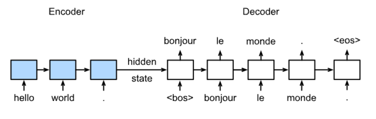

2、预测

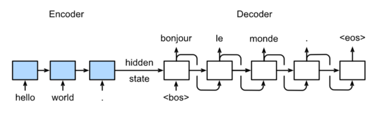

#### Encoder

```python
class Seq2SeqEncoder(d2l.Encoder):
    def __init__(self, vocab_size, embed_size, num_hiddens, num_layers,
                 dropout=0, **kwargs):
        super(Seq2SeqEncoder, self).__init__(**kwargs)
        self.num_hiddens=num_hiddens
        self.num_layers=num_layers
        self.embedding = nn.Embedding(vocab_size, embed_size)
        self.rnn = nn.LSTM(embed_size,num_hiddens, num_layers, dropout=dropout)
   
    def begin_state(self, batch_size, device):
        return [torch.zeros(size=(self.num_layers, batch_size, self.num_hiddens),  device=device),
                torch.zeros(size=(self.num_layers, batch_size, self.num_hiddens),  device=device)]
    def forward(self, X, *args):
        X = self.embedding(X) # X shape: (batch_size, seq_len, embed_size)
        X = X.transpose(0, 1)  # RNN needs first axes to be time
        # state = self.begin_state(X.shape[1], device=X.device)
        out, state = self.rnn(X)
        # The shape of out is (seq_len, batch_size, num_hiddens).
        # state contains the hidden state and the memory cell
        # of the last time step, the shape is (num_layers, batch_size, num_hiddens)
        return out, state
```

#### Decoder

```python
class Seq2SeqDecoder(d2l.Decoder):
    def __init__(self, vocab_size, embed_size, num_hiddens, num_layers,
                 dropout=0, **kwargs):
        super(Seq2SeqDecoder, self).__init__(**kwargs)
        self.embedding = nn.Embedding(vocab_size, embed_size)
        self.rnn = nn.LSTM(embed_size,num_hiddens, num_layers, dropout=dropout)
        self.dense = nn.Linear(num_hiddens,vocab_size)

    def init_state(self, enc_outputs, *args):
        return enc_outputs[1]

    def forward(self, X, state):
        X = self.embedding(X).transpose(0, 1)
        out, state = self.rnn(X, state)
        # Make the batch to be the first dimension to simplify loss computation.
        out = self.dense(out).transpose(0, 1)
        return out, state
```

#### SoftMax屏蔽

```python
def SequenceMask(X, X_len,value=0):
    maxlen = X.size(1)
    mask = torch.arange(maxlen)[None, :].to(X_len.device) < X_len[:, None]   
    X[~mask]=value
    return X
```

#### Beam Search

1、贪心算法

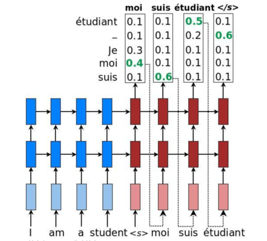

2、贪心算法+维特比算法

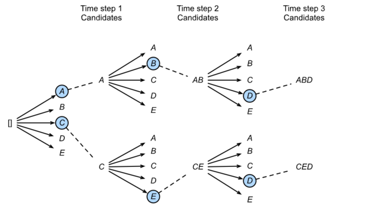

### 注意力机制与Seq2Seq模型

在“编码器—解码器（seq2seq），解码器在各个时间步依赖相同的背景变量（context vector）来获取输⼊序列信息。当编码器为循环神经⽹络时，背景变量来⾃它最终时间步的隐藏状态。将源序列输入信息以循环单位状态编码，然后将其传递给解码器以生成目标序列。

**问题**：RNN机制实际中存在长程梯度消失的问题，对于较长的句子，我们很难寄希望于将输入的序列转化为定长的向量而保存所有的有效信息，所以随着所需翻译句子的长度的增加，这种结构的效果会显著下降。

#### 注意力机制框架

1、询问（query） 2、键值对（key-value pairs）

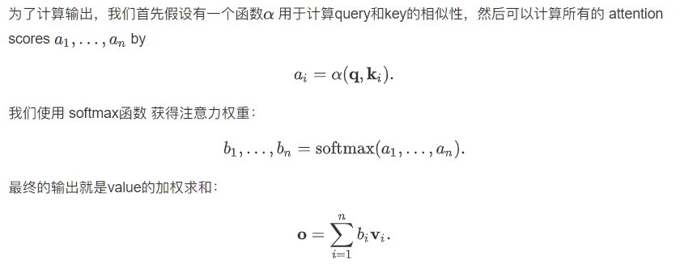

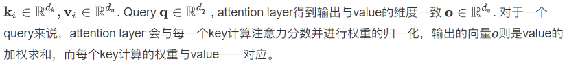

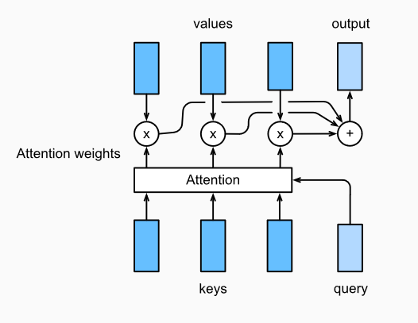

#### 点积注意力

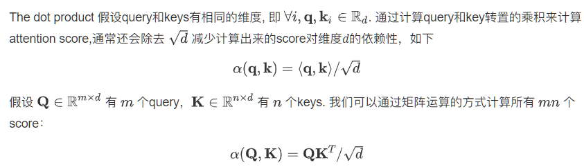

```python
class DotProductAttention(nn.Module): 
    def __init__(self, dropout, **kwargs):
        super(DotProductAttention, self).__init__(**kwargs)
        self.dropout = nn.Dropout(dropout)

    # query: (batch_size, #queries, d)
    # key: (batch_size, #kv_pairs, d)
    # value: (batch_size, #kv_pairs, dim_v)
    # valid_length: either (batch_size, ) or (batch_size, xx)
    def forward(self, query, key, value, valid_length=None):
        d = query.shape[-1]
        # set transpose_b=True to swap the last two dimensions of key
        
        scores = torch.bmm(query, key.transpose(1,2)) / math.sqrt(d)
        attention_weights = self.dropout(masked_softmax(scores, valid_length))
        print("attention_weight\n",attention_weights)
        return torch.bmm(attention_weights, value)
```

#### 多层感知机注意力

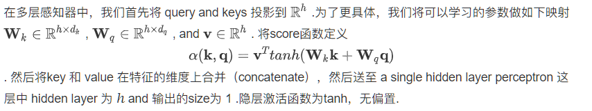

```python
class MLPAttention(nn.Module):  
    def __init__(self, units,ipt_dim,dropout, **kwargs):
        super(MLPAttention, self).__init__(**kwargs)
        # Use flatten=True to keep query's and key's 3-D shapes.
        self.W_k = nn.Linear(ipt_dim, units, bias=False)
        self.W_q = nn.Linear(ipt_dim, units, bias=False)
        self.v = nn.Linear(units, 1, bias=False)
        self.dropout = nn.Dropout(dropout)

    def forward(self, query, key, value, valid_length):
        query, key = self.W_k(query), self.W_q(key)
        #print("size",query.size(),key.size())
        # expand query to (batch_size, #querys, 1, units), and key to
        # (batch_size, 1, #kv_pairs, units). Then plus them with broadcast.
        features = query.unsqueeze(2) + key.unsqueeze(1)
        #print("features:",features.size())  #--------------开启
        scores = self.v(features).squeeze(-1) 
        attention_weights = self.dropout(masked_softmax(scores, valid_length))
        return torch.bmm(attention_weights, value)
```

#### 引入注意力机制的Seq2Seq模型

本节中将注意机制添加到sequence to sequence 模型中，以显式地使用权重聚合states。下图展示encoding 和decoding的模型结构，在时间步为t的时候。此刻attention layer保存着encodering看到的所有信息——encoding的每一步输出。在decoding阶段，解码器的t时刻的隐藏状态被当作query，encoder的每个时间步的hidden states作为key和value进行attention聚合. Attetion model的输出当作成上下文信息context vector，并与解码器输入Dt拼接起来一起送到解码器：

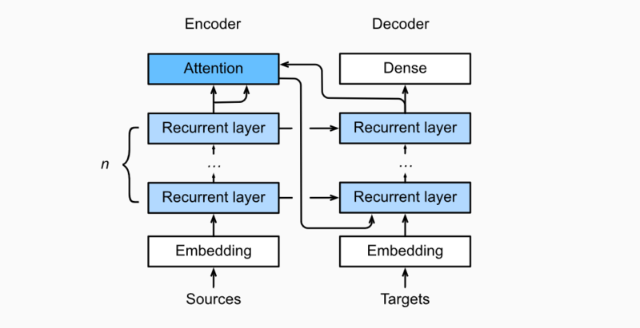

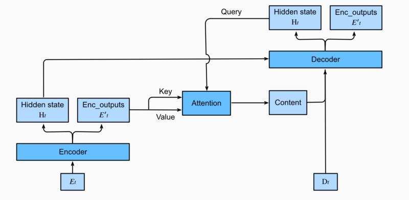

### Transformer

整合了以下网络的优点：

- CNNs 易于并行化，却不适合捕捉变长序列内的依赖关系。
- RNNs 适合捕捉长距离变长序列的依赖，但是却难以实现并行化处理序列。

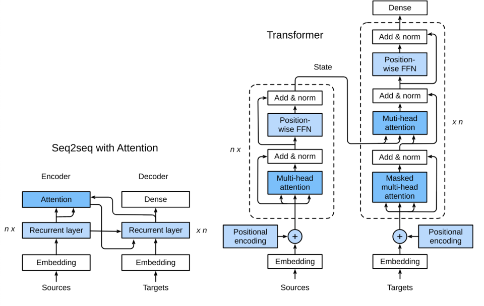

与Seq2Seq的区别

1. Transformer blocks：将seq2seq模型重的循环网络替换为了Transformer Blocks，该模块包含一个多头注意力层（Multi-head Attention Layers）以及两个position-wise feed-forward networks（FFN）。对于解码器来说，另一个多头注意力层被用于接受编码器的隐藏状态。
2. Add and norm：多头注意力层和前馈网络的输出被送到两个“add and norm”层进行处理，该层包含残差结构以及层归一化。
3. Position encoding：由于自注意力层并没有区分元素的顺序，所以一个位置编码层被用于向序列元素里添加位置信息。

#### 多头注意力层

自注意力

自注意力模型是一个正规的注意力模型，序列的每一个元素对应的key，value，query是完全一致的。与循环神经网络相比，自注意力对每个元素输出的计算是并行的，所以我们可以高效的实现这个模块。

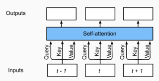

**多头注意力层**包含h个并行的自注意力层，每一个这种层被成为一个head

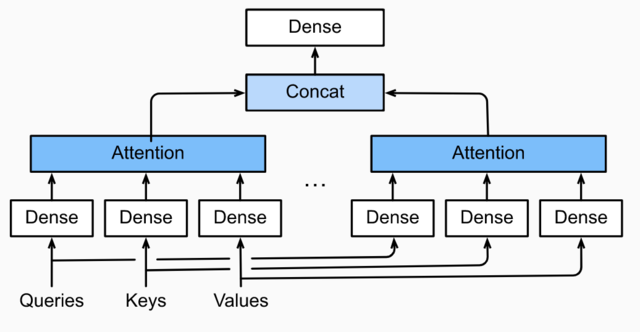

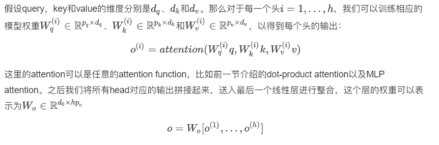

#### 基于位置的前馈网络

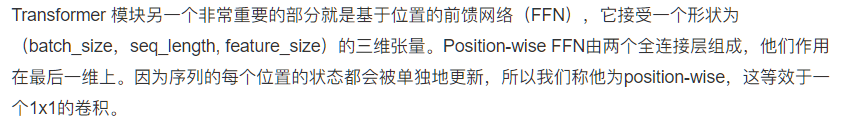

#### Add and Norm

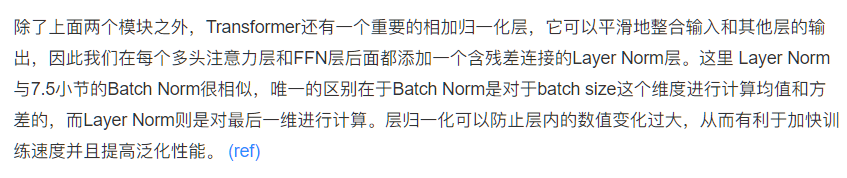

#### 位置编码

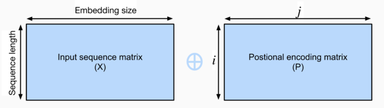

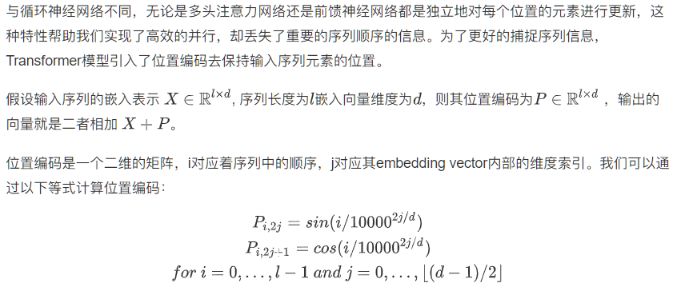