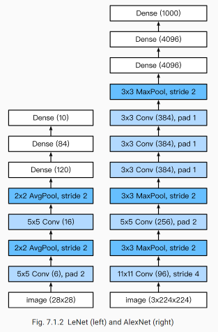

### Task05-pyTorch（卷积神经网络基础、LeNet、卷积神经网络进阶）

### 卷积神经网络基础

**二维互相关运算**


二维互相关（cross-correlation）运算的输入是一个二维输入数组和一个二维核（kernel）数组，输出也是一个二维数组，其中核数组通常称为卷积核或过滤器（filter）。卷积核的尺寸通常小于输入数组，卷积核在输入数组上滑动，在每个位置上，卷积核与该位置处的输入子数组按元素相乘并求和，得到输出数组中相应位置的元素。

```python
import torch 
import torch.nn as nn

def corr2d(X, K):
    H, W = X.shape
    h, w = K.shape
    Y = torch.zeros(H - h + 1, W - w + 1)
    for i in range(Y.shape[0]):
        for j in range(Y.shape[1]):
            Y[i, j] = (X[i: i + h, j: j + w] * K).sum()
    return Y
```

**二维卷积层**

二维卷积层将输入和卷积核做互相关运算，并加上一个标量偏置来得到输出。卷积层的模型参数包括卷积核和标量偏置。

**互相关运算与卷积运算**

卷积层得名于卷积运算，但卷积层中用到的并非卷积运算而是互相关运算。我们将核数组上下翻转、左右翻转，再与输入数组做互相关运算，这一过程就是卷积运算。由于*卷积层的核数组是可学习的*，所以使用互相关运算与使用卷积运算并无本质区别。

**特征图与感受野**


**填充**


**步幅**


**多输入通道与多输出通道**

*多输入通道*


*多输出通道*


**卷积层与全连接层对比**

1、一是全连接层把图像展平成一个向量，在输入图像上相邻的元素可能因为展平操作不再相邻，网络难以捕捉局部信息。而卷积层的设计，天然地具有提取局部信息的能力。

2、二是卷积层的参数量更少。不考虑偏置的情况下，一个形状为(ci,co,h,w)的卷积核的参数量是ci×co×h×w，与输入图像的宽高无关。假如一个卷积层的输入和输出形状分别是(c1,h1,w1)和(c2,h2,w2)，如果要用全连接层进行连接，参数数量就是c1×c2×h1×w1×h2×w2。使用卷积层可以以较少的参数数量来处理更大的图像。

```python
X = torch.rand(4, 2, 3, 5)
print(X.shape)

conv2d = nn.Conv2d(in_channels=2, out_channels=3, kernel_size=(3, 5), stride=1, padding=(1, 2))
Y = conv2d(X)
```

**池化**

池化层主要用于缓解卷积层对位置的过度敏感性。同卷积层一样，池化层每次对输入数据的一个固定形状窗口（又称池化窗口）中的元素计算输出，池化层直接计算池化窗口内元素的最大值或者平均值，该运算也分别叫做最大池化或平均池化。

```python
X = torch.arange(32, dtype=torch.float32).view(1, 2, 4, 4)
pool2d = nn.MaxPool2d(kernel_size=3, padding=1, stride=(2, 1))
Y = pool2d(X)
```

### LeNet

使用全连接层的局限性：

- 图像在同一列邻近的像素在这个向量中可能相距较远。它们构成的模式可能难以被模型识别。
- 对于大尺寸的输入图像，使用全连接层容易导致模型过大。

使用卷积层的优势：

- 卷积层保留输入形状。
- 卷积层通过滑动窗口将同一卷积核与不同位置的输入重复计算，从而避免参数尺寸过大。


卷积层块里的基本单位是卷积层后接平均池化层：卷积层用来识别图像里的空间模式，如线条和物体局部，之后的平均池化层则用来降低卷积层对位置的敏感性。

**激活函数**：Sigmoid

### Modern CNN

#### 深度卷积神经网络（AlexNet）

----->首次证明了学习到的特征可以超越⼿⼯设计的特征，从而⼀举打破计算机视觉研究的前状。

LeNet: 在大的真实数据集上的表现并不尽如⼈意。
1.神经网络计算复杂。
2.还没有⼤量深⼊研究参数初始化和⾮凸优化算法等诸多领域。

特点：

1. 8层变换，其中有5层卷积和2层全连接隐藏层，以及1个全连接输出层。
2. 将sigmoid激活函数改成了更加简单的ReLU激活函数。
3. 用Dropout来控制全连接层的模型复杂度。
4. 引入数据增强，如翻转、裁剪和颜色变化，从而进一步扩大数据集来缓解过拟合。



#### 使用重复基础块的网络（VGG）


#### 网络中的网络(NiN)

LeNet、AlexNet和VGG：先以由卷积层构成的模块充分抽取 空间特征，再以由全连接层构成的模块来输出分类结果。

NiN：串联多个由卷积层和“全连接”层构成的小⽹络来构建⼀个深层⽹络。

"全连接"：由1x1卷积核等效的全连接层，保证输入和输出维度相等。


**1×1卷积核作用**
1.放缩通道数：通过控制卷积核的数量达到通道数的放缩。
2.增加非线性。1×1卷积核的卷积过程相当于全连接层的计算过程，并且还加入了非线性激活函数，从而可以增加网络的非线性。
3.计算参数少

```python
def nin_block(in_channels, out_channels, kernel_size, stride, padding):
    blk = nn.Sequential(nn.Conv2d(in_channels, out_channels, kernel_size, stride, padding),
                        nn.ReLU(),
                        nn.Conv2d(out_channels, out_channels, kernel_size=1),
                        nn.ReLU(),
                        nn.Conv2d(out_channels, out_channels, kernel_size=1),
                        nn.ReLU())
    return blk
```

#### GoogLeNet


1. 由Inception基础块组成。

2. Inception块相当于⼀个有4条线路的⼦⽹络。它通过不同窗口形状的卷积层和最⼤池化层来并⾏抽取信息，并使⽤1×1卷积层减少通道数从而降低模型复杂度。

3. 可以⾃定义的超参数是每个层的输出通道数，我们以此来控制模型复杂度

   ```python
   class Inception(nn.Module):
       # c1 - c4为每条线路里的层的输出通道数
       def __init__(self, in_c, c1, c2, c3, c4):
           super(Inception, self).__init__()
           # 线路1，单1 x 1卷积层
           self.p1_1 = nn.Conv2d(in_c, c1, kernel_size=1)
           # 线路2，1 x 1卷积层后接3 x 3卷积层
           self.p2_1 = nn.Conv2d(in_c, c2[0], kernel_size=1)
           self.p2_2 = nn.Conv2d(c2[0], c2[1], kernel_size=3, padding=1)
           # 线路3，1 x 1卷积层后接5 x 5卷积层
           self.p3_1 = nn.Conv2d(in_c, c3[0], kernel_size=1)
           self.p3_2 = nn.Conv2d(c3[0], c3[1], kernel_size=5, padding=2)
           # 线路4，3 x 3最大池化层后接1 x 1卷积层
           self.p4_1 = nn.MaxPool2d(kernel_size=3, stride=1, padding=1)
           self.p4_2 = nn.Conv2d(in_c, c4, kernel_size=1)
   
       def forward(self, x):
           p1 = F.relu(self.p1_1(x))
           p2 = F.relu(self.p2_2(F.relu(self.p2_1(x))))
           p3 = F.relu(self.p3_2(F.relu(self.p3_1(x))))
           p4 = F.relu(self.p4_2(self.p4_1(x)))
           return torch.cat((p1, p2, p3, p4), dim=1)  # 在通道维上连结输出
   ```

   **完整模型**

