### Task06-PyTorch（批量归一化和残差网络、凸优化、梯度下降）

### 批量归一化和残差网络

**批量归一化（BatchNormalization）**

1、对输入的标准化（浅层模型）

处理后的任意一个特征在数据集中所有样本上的均值为0、标准差为1。标准化处理输入数据使各个特征的分布相近

2、批量归一化（深度模型）

利用小批量上的均值和标准差，不断调整神经网络中间输出，从而使整个神经网络在各层的中间输出的数值更稳定。

- [ ] 对全连接层做批量归一化

位置：全连接层中的仿射变换和激活函数之间

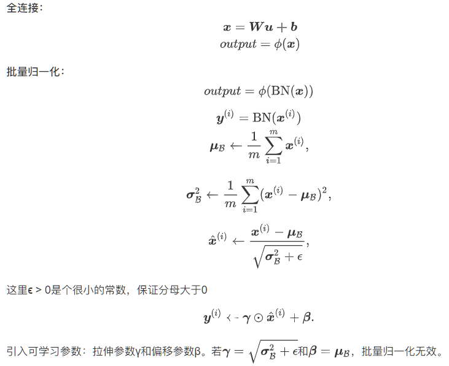

- [ ] 对卷积层做批量归一化

  位置：卷积计算之后、应⽤激活函数之前。
  如果卷积计算输出多个通道，我们需要对这些通道的输出分别做批量归一化，且每个通道都拥有独立的拉伸和偏移参数。 计算：对单通道，batchsize=m,卷积计算输出=pxq 对该通道中m×p×q个元素同时做批量归一化,使用相同的均值和方差。

- [ ] 预测时的批量归一化

​       训练：以batch为单位,对每个batch计算均值和方差。
​       预测：用移动平均估算整个训练数据集的样本均值和方差。

**基于LeNet的BN简洁实现**

```python
net = nn.Sequential(
            nn.Conv2d(1, 6, 5), # in_channels, out_channels, kernel_size
            nn.BatchNorm2d(6),
            nn.Sigmoid(),
            nn.MaxPool2d(2, 2), # kernel_size, stride
            nn.Conv2d(6, 16, 5),
            nn.BatchNorm2d(16),
            nn.Sigmoid(),
            nn.MaxPool2d(2, 2),
            d2l.FlattenLayer(),
            nn.Linear(16*4*4, 120),
            nn.BatchNorm1d(120),
            nn.Sigmoid(),
            nn.Linear(120, 84),
            nn.BatchNorm1d(84),
            nn.Sigmoid(),
            nn.Linear(84, 10)
        )

optimizer = torch.optim.Adam(net.parameters(), lr=lr)
d2l.train_ch5(net, train_iter, test_iter, batch_size, optimizer, device, num_epochs)

```

**残差网络（ResNet）**

深度学习的问题：深度CNN网络达到一定深度后再一味地增加层数并不能带来进一步地分类性能提高，反而会招致网络收敛变得更慢，准确率也变得更差。

恒等映射：
左边：f(x)=x
右边：f(x)-x=0 （易于捕捉恒等映射的细微波动）

在残差块中，输⼊可通过跨层的数据线路更快 地向前传播。

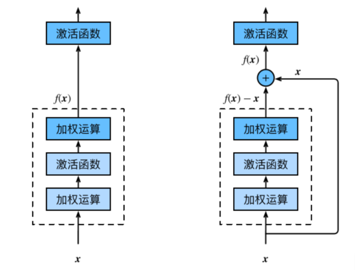

**稠密连接网络（DenseNet）**

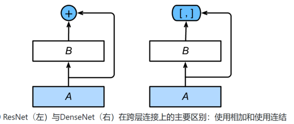

稠密块（dense block）： 定义了输入和输出是如何连结的。
过渡层（transition layer）：用来控制通道数，使之不过大。(1x1卷积层来减小通道数)


**习题错误：**

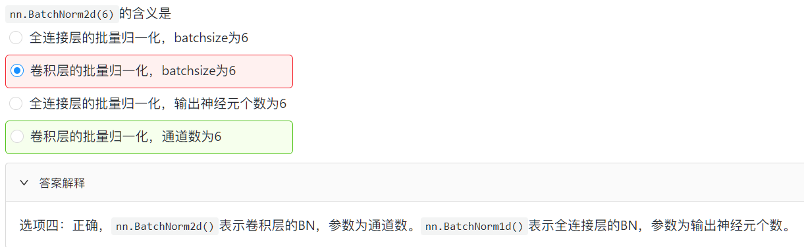


**讨论：**

**1.做完batach nornamlization后为何又拉伸/偏移？**

标准化处理输入数据使各个特征的分布相近，尽可能消除量纲和数据波动带来的影响。 从而能让模型cover住更多情况，获得性能提升。然而对于深度模型来说，仅仅是对输入进行标准化是不够的，因为模型的非线性拟合能力实在太强了。输入可能只发生比较微弱的变化，就会导致中间的输出的取值不太稳定，波动比较剧烈。你无法像对输入进行标准化一样上来就把全局的均值和方差都计算出来。因为随着一个batch一个batch的训练，中间层的输出在不断发生变化，因此批量归一化的具体做法是：利用小批量上的均值和标准差，不断调整神经网络中间输出，从而使整个神经网络在各层的中间输出的数值更稳定。但是如此复杂的拟合函数，我们显然无法做出均值0标准差1的标准化结果就是最优的这样的假设，因此不妨加入两个可学习的参数再对标准化后的结果进行拉伸/偏移。

**2、BN效果为何提升效果**

- [ ] 一个是前面提到的标准化带来的泛化性能的提升。
- [ ] 还有一点就是它捎带着一定程度缓解了梯度消失的问题，因为它把进到激活函数前的输入X拉回了梯度变化比较显著的区域

### 凸优化

**优化与评估**

- 优化方法目标：训练集损失函数值
- 深度学习目标：测试集损失函数值（泛化性）

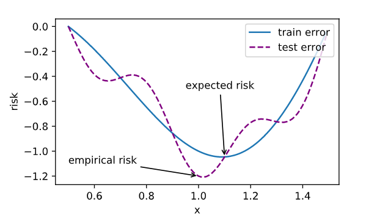

**优化在深度学习中的挑战**

1、局部最小值

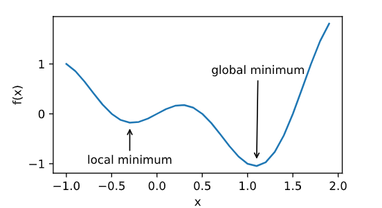

2、鞍点

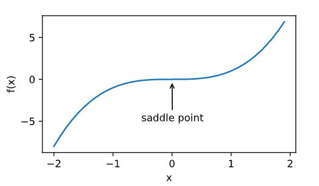

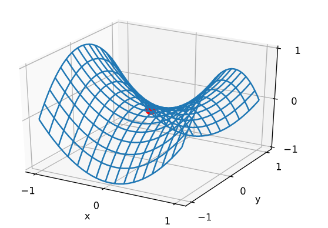

梯度等于零，在其附近Hessian矩阵有正的和负的特征值，行列式小于0，即是不定的。

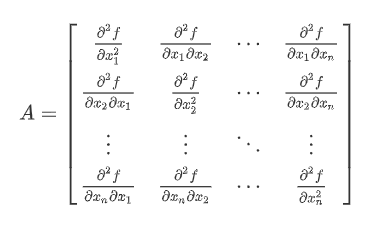

3、梯度消失

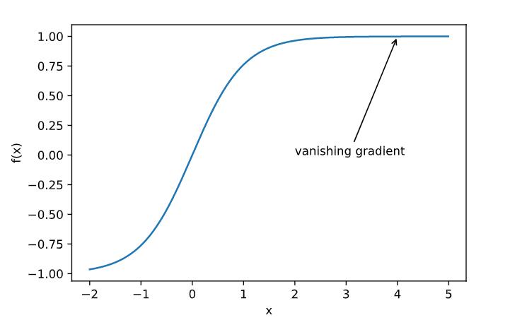

**凸函数**

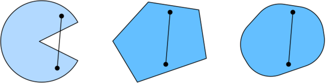


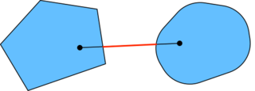

第二行：凸图形的合集也是凸图形

第三行：凸图形的并集不一定是凸图形


**性质**

1. 无局部极小值
2. 与凸集的关系
3. 二阶条件

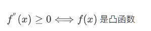

**限制条件的优化**

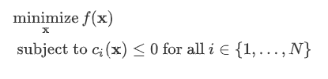

1、拉格朗日乘子法

2、惩罚项

3、投影

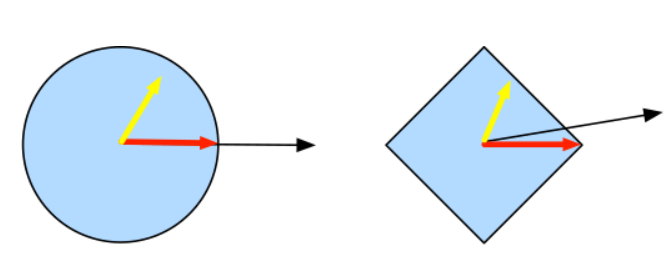

### 梯度下降

**一维梯度下降**

***沿梯度反方向移动自变量可以减小函数值**

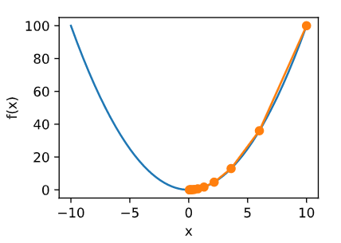

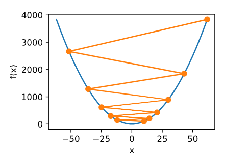

**局部极小值**

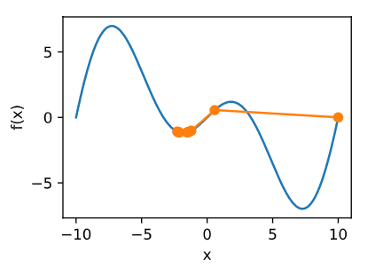

**多维梯度下降**

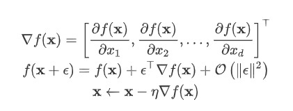

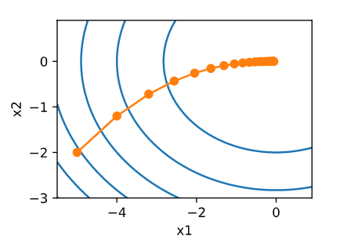

**自适应方法**

**1、牛顿法**

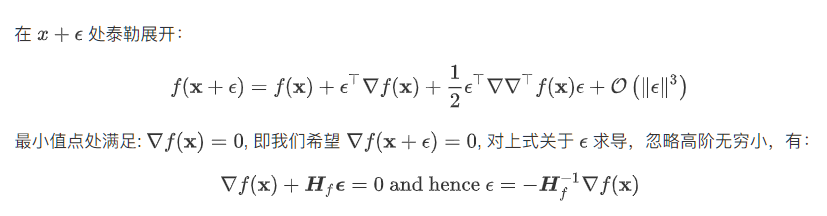

Heissan阵辅助梯度下降

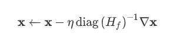

**2、随机梯度下降**

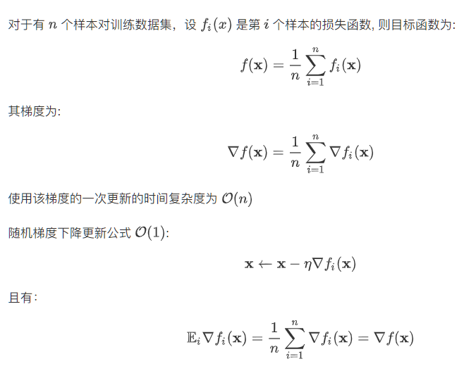

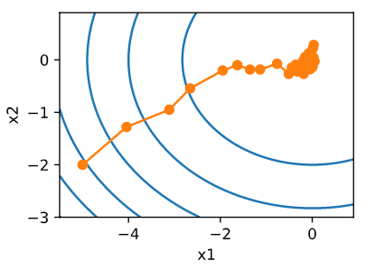

**动态学习率减少最小值点抖动**

- [ ] 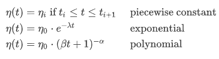

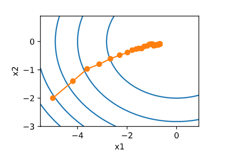

**3、小批量随机梯度下降**

```python
# 本函数与原书不同的是这里第一个参数优化器函数而不是优化器的名字
# 例如: optimizer_fn=torch.optim.SGD, optimizer_hyperparams={"lr": 0.05}
def train_pytorch_ch7(optimizer_fn, optimizer_hyperparams, features, labels,
                    batch_size=10, num_epochs=2):
    # 初始化模型
    net = nn.Sequential(
        nn.Linear(features.shape[-1], 1)
    )
    loss = nn.MSELoss()
    optimizer = optimizer_fn(net.parameters(), **optimizer_hyperparams)

    def eval_loss():
        return loss(net(features).view(-1), labels).item() / 2

    ls = [eval_loss()]
    data_iter = torch.utils.data.DataLoader(
        torch.utils.data.TensorDataset(features, labels), batch_size, shuffle=True)

    for _ in range(num_epochs):
        start = time.time()
        for batch_i, (X, y) in enumerate(data_iter):
            # 除以2是为了和train_ch7保持一致, 因为squared_loss中除了2
            l = loss(net(X).view(-1), y) / 2 
            
            optimizer.zero_grad()
            l.backward()
            optimizer.step()
            if (batch_i + 1) * batch_size % 100 == 0:
                ls.append(eval_loss())
    # 打印结果和作图
    print('loss: %f, %f sec per epoch' % (ls[-1], time.time() - start))
    d2l.set_figsize()
    d2l.plt.plot(np.linspace(0, num_epochs, len(ls)), ls)
    d2l.plt.xlabel('epoch')
    d2l.plt.ylabel('loss')
```

