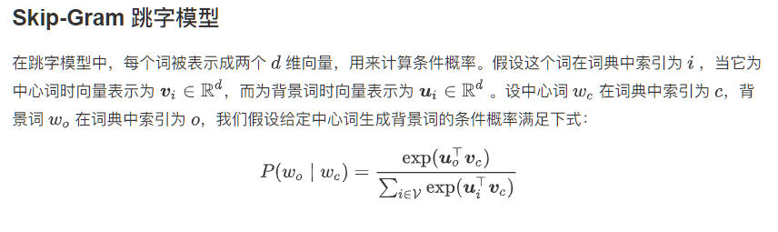

### Task07-PyTorch（优化算法进阶；word2vec；词嵌入进阶）

### 优化算法进阶

#### ill-conditioned Problem


可以看到，同一位置上，目标函数在竖直方向（x2轴方向）比在水平方向（x1轴方向）的斜率的绝对值更大。因此，给定学习率，梯度下降迭代自变量时会使自变量在竖直方向比在水平方向移动幅度更大。那么，我们需要一个较小的学习率从而避免自变量在竖直方向上越过目标函数最优解。然而，这会造成自变量在水平方向上朝最优解移动变慢。

### Solution to ill-condition[¶](https://www.kesci.com/api/notebooks/5e47cf8317aec8002dc573d2/RenderedContent?embed_doc=true#Solution-to-ill-condition)

- **Preconditioning gradient vector**: applied in Adam, RMSProp, AdaGrad, Adelta, KFC, Natural gradient and other secord-order optimization algorithms.
- **Averaging history gradient**: like momentum, which allows larger learning rates to accelerate convergence; applied in Adam, RMSProp, SGD momentum.

**动量法**


**指数加权移动平均**


**指数加权移动平均理解动量法**


```python
d2l.train_pytorch_ch7(torch.optim.SGD, {'lr': 0.004, 'momentum': 0.9},
                    features, labels)
```

### AdaGrad


### RMSProp

当学习率在迭代早期降得较快且当前解依然不佳时，AdaGrad算法在迭代后期由于学习率过小，可能较难找到一个有用的解。为了解决这一问题，RMSProp算法对AdaGrad算法做了修改。


### AdaDelta

除了RMSProp算法以外，另一个常用优化算法AdaDelta算法也针对AdaGrad算法在迭代后期可能较难找到有用解的问题做了改进


### Adam

Adam算法在RMSProp算法基础上对小批量随机梯度也做了指数加权移动平均 


### Word2vec

**one-hot**:构造起来很容易，但通常并不是一个好选择。一个主要的原因是，one-hot 词向量无法准确表达不同词之间的相似度，如我们常常使用的余弦相似度。


### 二次采样


```python
def discard(idx):
    '''
    @params:
        idx: 单词的下标
    @return: True/False 表示是否丢弃该单词
    '''
    return random.uniform(0, 1) < 1 - math.sqrt(
        1e-4 / counter[idx_to_token[idx]] * num_tokens)

subsampled_dataset = [[tk for tk in st if not discard(tk)] for st in dataset]
print('# tokens: %d' % sum([len(st) for st in subsampled_dataset]))

def compare_counts(token):
    return '# %s: before=%d, after=%d' % (token, sum(
        [st.count(token_to_idx[token]) for st in dataset]), sum(
        [st.count(token_to_idx[token]) for st in subsampled_dataset]))

print(compare_counts('the'))
print(compare_counts('join'))
```




### 词嵌入进阶

虽然 Word2Vec 已经能够成功地将离散的单词转换为连续的词向量，并能一定程度上地保存词与词之间的近似关系，但 Word2Vec 模型仍不是完美的，它还可以被进一步地改进：

1. 子词嵌入（subword embedding）：[FastText](https://zh.d2l.ai/chapter_natural-language-processing/fasttext.html) 以固定大小的 n-gram 形式将单词更细致地表示为了子词的集合，而 [BPE (byte pair encoding)](https://d2l.ai/chapter_natural-language-processing/subword-embedding.html#byte-pair-encoding) 算法则能根据语料库的统计信息，自动且动态地生成高频子词的集合；
2. [GloVe 全局向量的词嵌入](https://zh.d2l.ai/chapter_natural-language-processing/glove.html): 通过等价转换 Word2Vec 模型的条件概率公式，我们可以得到一个全局的损失函数表达，并在此基础上进一步优化模型。

### GloVe全局向量的词嵌入


### 近义词

由于词向量空间中的余弦相似性可以衡量词语含义的相似性，我们可以通过寻找空间中的 k 近邻，来查询单词的近义词。

```python
def knn(W, x, k):
    '''
    @params:
        W: 所有向量的集合
        x: 给定向量
        k: 查询的数量
    @outputs:
        topk: 余弦相似性最大k个的下标
        [...]: 余弦相似度
    '''
    cos = torch.matmul(W, x.view((-1,))) / (
        (torch.sum(W * W, dim=1) + 1e-9).sqrt() * torch.sum(x * x).sqrt())
    _, topk = torch.topk(cos, k=k)
    topk = topk.cpu().numpy()
    return topk, [cos[i].item() for i in topk]

def get_similar_tokens(query_token, k, embed):
    '''
    @params:
        query_token: 给定的单词
        k: 所需近义词的个数
        embed: 预训练词向量
    '''
    topk, cos = knn(embed.vectors,
                    embed.vectors[embed.stoi[query_token]], k+1)
    for i, c in zip(topk[1:], cos[1:]):  # 除去输入词
        print('cosine sim=%.3f: %s' % (c, (embed.itos[i])))

get_similar_tokens('chip', 3, glove)
```

### 类比词

除了求近义词以外，我们还可以使用预训练词向量求词与词之间的类比关系，例如“man”之于“woman”相当于“son”之于“daughter”。求类比词问题可以定义为：对于类比关系中的4个词“a 之于 b 相当于 c 之于 d”，给定前3个词 a,b,c 求 d。求类比词的思路是，搜索与 vec(c)+vec(b)−vec(a) 的结果向量最相似的词向量，其中 vec(w) 为 w 的词向量。

```python
def get_analogy(token_a, token_b, token_c, embed):
    '''
    @params:
        token_a: 词a
        token_b: 词b
        token_c: 词c
        embed: 预训练词向量
    @outputs:
        res: 类比词d
    '''
    vecs = [embed.vectors[embed.stoi[t]] 
                for t in [token_a, token_b, token_c]]
    x = vecs[1] - vecs[0] + vecs[2]
    topk, cos = knn(embed.vectors, x, 1)
    res = embed.itos[topk[0]]
    return res

get_analogy('man', 'woman', 'son', glove)
```

