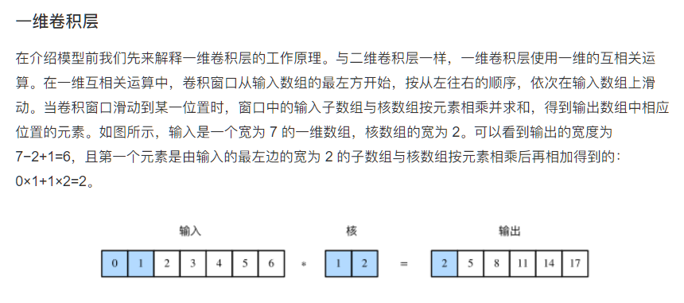
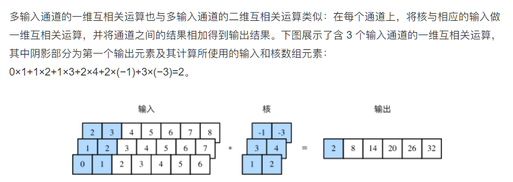
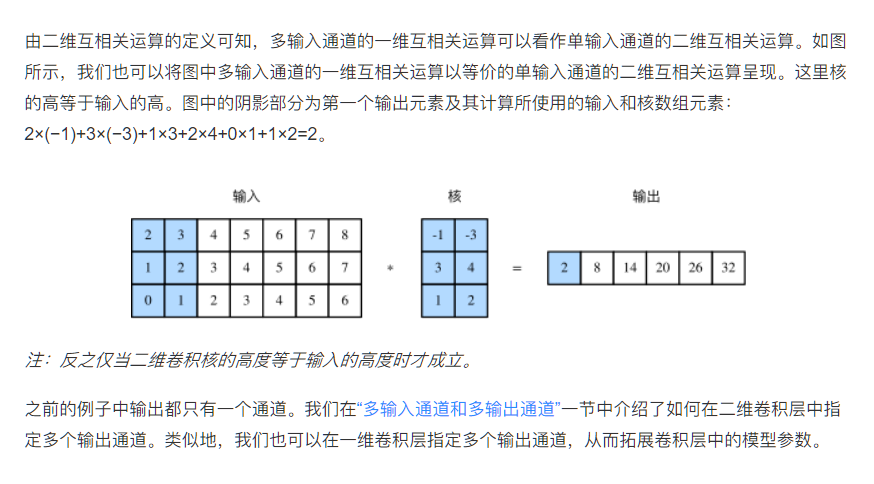
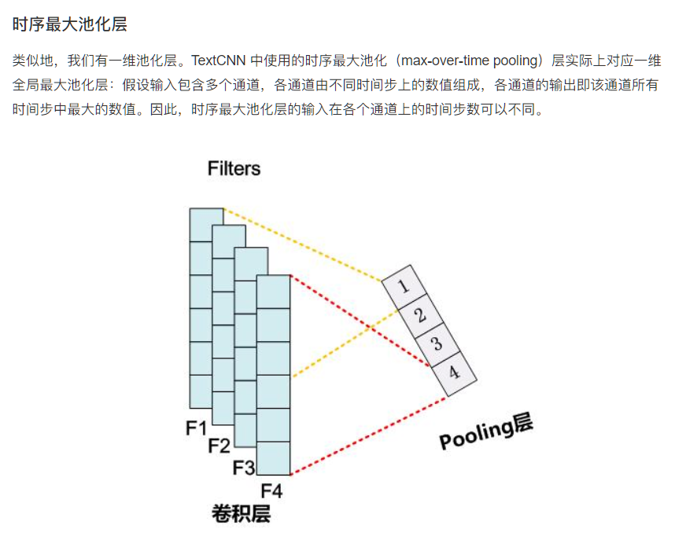
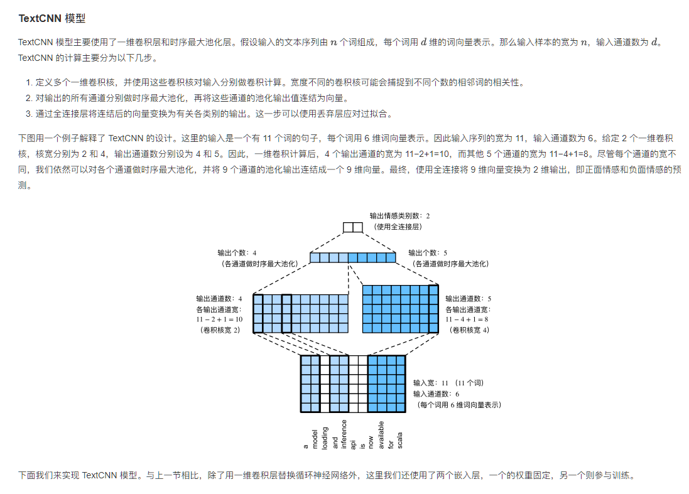
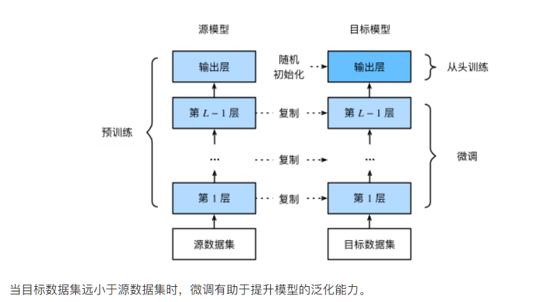

### Task08-PyTorch（文本分类；数据增强；模型微调）

### 文本情感分类

#### 循环神经网络进行情感分类

```python
class BiRNN(nn.Module):
    def __init__(self, vocab, embed_size, num_hiddens, num_layers):
        '''
        @params:
            vocab: 在数据集上创建的词典，用于获取词典大小
            embed_size: 嵌入维度大小
            num_hiddens: 隐藏状态维度大小
            num_layers: 隐藏层个数
        '''
        super(BiRNN, self).__init__()
        self.embedding = nn.Embedding(len(vocab), embed_size)
        
        # encoder-decoder framework
        # bidirectional设为True即得到双向循环神经网络
        self.encoder = nn.LSTM(input_size=embed_size, 
                                hidden_size=num_hiddens, 
                                num_layers=num_layers,
                                bidirectional=True)
        self.decoder = nn.Linear(4*num_hiddens, 2) # 初始时间步和最终时间步的隐藏状态作为全连接层输入
        
    def forward(self, inputs):
        '''
        @params:
            inputs: 词语下标序列，形状为 (batch_size, seq_len) 的整数张量
        @return:
            outs: 对文本情感的预测，形状为 (batch_size, 2) 的张量
        '''
        # 因为LSTM需要将序列长度(seq_len)作为第一维，所以需要将输入转置
        embeddings = self.embedding(inputs.permute(1, 0)) # (seq_len, batch_size, d)
        # rnn.LSTM 返回输出、隐藏状态和记忆单元，格式如 outputs, (h, c)
        outputs, _ = self.encoder(embeddings) # (seq_len, batch_size, 2*h)
        encoding = torch.cat((outputs[0], outputs[-1]), -1) # (batch_size, 4*h)
        outs = self.decoder(encoding) # (batch_size, 2)
        return outs

embed_size, num_hiddens, num_layers = 100, 100, 2
net = BiRNN(vocab, embed_size, num_hiddens, num_layers)
```

#### 卷积神经网络进行情感分析











```python
class TextCNN(nn.Module):
    def __init__(self, vocab, embed_size, kernel_sizes, num_channels):
        '''
        @params:
            vocab: 在数据集上创建的词典，用于获取词典大小
            embed_size: 嵌入维度大小
            kernel_sizes: 卷积核大小列表
            num_channels: 卷积通道数列表
        '''
        super(TextCNN, self).__init__()
        self.embedding = nn.Embedding(len(vocab), embed_size) # 参与训练的嵌入层
        self.constant_embedding = nn.Embedding(len(vocab), embed_size) # 不参与训练的嵌入层
        
        self.pool = GlobalMaxPool1d() # 时序最大池化层没有权重，所以可以共用一个实例
        self.convs = nn.ModuleList()  # 创建多个一维卷积层
        for c, k in zip(num_channels, kernel_sizes):
            self.convs.append(nn.Conv1d(in_channels = 2*embed_size, 
                                        out_channels = c, 
                                        kernel_size = k))
            
        self.decoder = nn.Linear(sum(num_channels), 2)
        self.dropout = nn.Dropout(0.5) # 丢弃层用于防止过拟合

    def forward(self, inputs):
        '''
        @params:
            inputs: 词语下标序列，形状为 (batch_size, seq_len) 的整数张量
        @return:
            outputs: 对文本情感的预测，形状为 (batch_size, 2) 的张量
        '''
        embeddings = torch.cat((
            self.embedding(inputs), 
            self.constant_embedding(inputs)), dim=2) # (batch_size, seq_len, 2*embed_size)
        # 根据一维卷积层要求的输入格式，需要将张量进行转置
        embeddings = embeddings.permute(0, 2, 1) # (batch_size, 2*embed_size, seq_len)
        
        encoding = torch.cat([
            self.pool(F.relu(conv(embeddings))).squeeze(-1) for conv in self.convs], dim=1)
        # encoding = []
        # for conv in self.convs:
        #     out = conv(embeddings) # (batch_size, out_channels, seq_len-kernel_size+1)
        #     out = self.pool(F.relu(out)) # (batch_size, out_channels, 1)
        #     encoding.append(out.squeeze(-1)) # (batch_size, out_channels)
        # encoding = torch.cat(encoding) # (batch_size, out_channels_sum)
        
        # 应用丢弃法后使用全连接层得到输出
        outputs = self.decoder(self.dropout(encoding))
        return outputs

embed_size, kernel_sizes, nums_channels = 100, [3, 4, 5], [100, 100, 100]
net = TextCNN(vocab, embed_size, kernel_sizes, nums_channels)
```

### 数据增强

#### 图像增广

（深度卷积神经网络）里我们提到过，大规模数据集是成功应用深度神经网络的前提。图像增广（image augmentation）技术通过对训练图像做一系列随机改变，来产生相似但又不同的训练样本，从而扩大训练数据集的规模。图像增广的另一种解释是，随机改变训练样本可以降低模型对某些属性的依赖，从而提高模型的泛化能力。例如，我们可以对图像进行不同方式的裁剪，使感兴趣的物体出现在不同位置，从而减轻模型对物体出现位置的依赖性。我们也可以调整亮度、色彩等因素来降低模型对色彩的敏感度。可以说，在当年AlexNet的成功中，图像增广技术功不可没。本节我们将讨论这个在计算机视觉里被广泛使用的技术。

### 模型微调

在前面的一些章节中，我们介绍了如何在只有6万张图像的Fashion-MNIST训练数据集上训练模型。我们还描述了学术界当下使用最广泛的大规模图像数据集ImageNet，它有超过1,000万的图像和1,000类的物体。然而，我们平常接触到数据集的规模通常在这两者之间。

假设我们想从图像中识别出不同种类的椅子，然后将购买链接推荐给用户。一种可能的方法是先找出100种常见的椅子，为每种椅子拍摄1,000张不同角度的图像，然后在收集到的图像数据集上训练一个分类模型。这个椅子数据集虽然可能比Fashion-MNIST数据集要庞大，但样本数仍然不及ImageNet数据集中样本数的十分之一。这可能会导致适用于ImageNet数据集的复杂模型在这个椅子数据集上过拟合。同时，因为数据量有限，最终训练得到的模型的精度也可能达不到实用的要求。

为了应对上述问题，一个显而易见的解决办法是收集更多的数据。然而，收集和标注数据会花费大量的时间和资金。例如，为了收集ImageNet数据集，研究人员花费了数百万美元的研究经费。虽然目前的数据采集成本已降低了不少，但其成本仍然不可忽略。

另外一种解决办法是应用迁移学习（transfer learning），将从源数据集学到的知识迁移到目标数据集上。例如，虽然ImageNet数据集的图像大多跟椅子无关，但在该数据集上训练的模型可以抽取较通用的图像特征，从而能够帮助识别边缘、纹理、形状和物体组成等。这些类似的特征对于识别椅子也可能同样有效。

本节我们介绍迁移学习中的一种常用技术：微调（fine tuning）。如图9.1所示，微调由以下4步构成。

1. 在源数据集（如ImageNet数据集）上预训练一个神经网络模型，即源模型。
2. 创建一个新的神经网络模型，即目标模型。它复制了源模型上除了输出层外的所有模型设计及其参数。我们假设这些模型参数包含了源数据集上学习到的知识，且这些知识同样适用于目标数据集。我们还假设源模型的输出层跟源数据集的标签紧密相关，因此在目标模型中不予采用。
3. 为目标模型添加一个输出大小为目标数据集类别个数的输出层，并随机初始化该层的模型参数。
4. 在目标数据集（如椅子数据集）上训练目标模型。我们将从头训练输出层，而其余层的参数都是基于源模型的参数微调得到的。

